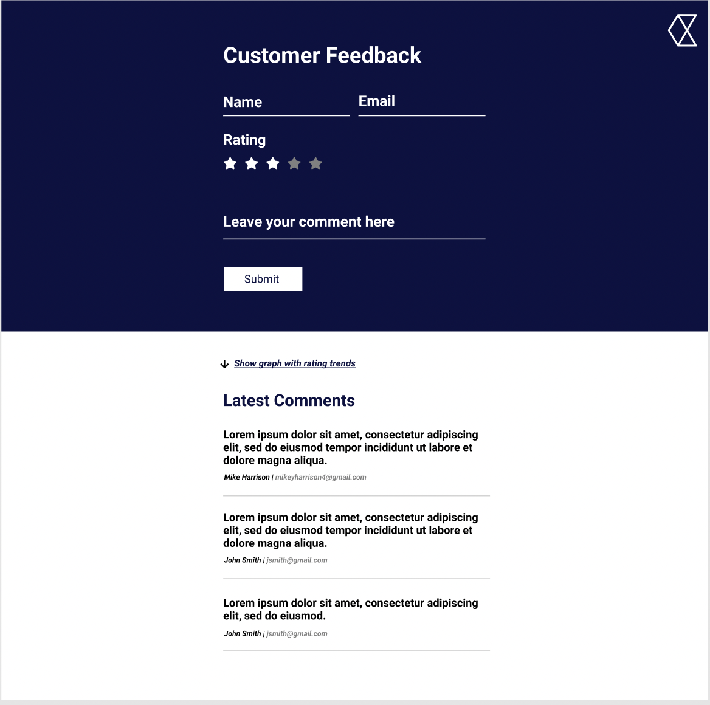
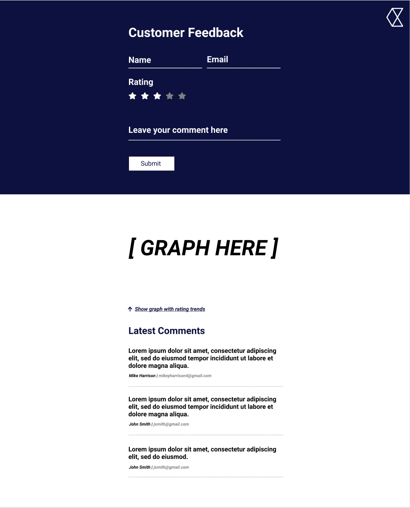

# Installation
All below commands can be run in the projects root directory.

`npm run start` - Starts the app on 
[http://localhost:3000](http://localhost:3000)
and starts the mock server on 
[http://localhost:3001](http://localhost:3001)

`npm run test` - Runs the test suite and shows its coverage

# How to use
The application consists of two main parts, the feedback form
and the list of comments.
- Feedback form - allows you to submit comments. Entering your name, email and a rating for the feedback is mandatory for this part of the application.
- Comments - displays the list of comments that users have left, with the name, email and rating also visible. If enough comments are displayed, pagination will appear allowing you to flick through the comments using the numbers.

Submitting a comment using the feedback form will automatically update the comment list without the need to refresh. You will not be able to submit feedback if the form is not filled out correctly.

Under the comment section, there is a button which gives you the option to see a graph with useful rating metrics that have been left by other users.

# Assumptions

- Graph to show trends on the ratings that have been left with all previously submitted reviews

# Sketches of the design
Figma was used to generate the design for this application.

# Tech used

**_Setup_**
- **Create React App** - provides you with the necessary boiler-plate code to get started quickly
- **eslint** - with my own custom config as this is what I am used to and it nicely deals with a lot of the formatting issues that can occur
- **JSON Server** - as this is a FE project, the main focus was not on creating an API to make requests to. This package creates a fake REST API out of the box and holds the data in a persisted json file
- **Concurrently** - this package allows you to simultaneously run the server & client code with one command
- - **mockaroo** - used to efficiently generate mock data

**_Design_**
- **Tailwind** - a CSS framework that gives you styles to use in your application out of the box. The difference with this framework compared to others is that it gives you more control over styling, resulting in it being highly customizable whilst still having the benefits of using its base styles

**_Tech packages_**
- **React Query** - provides hooks to fetch asynchronous data. It handles background updates and caching with zero-configuration. This was chosen primarily because it greatly de-clutters the code as it avoids the need in creating state for all of the information you get back from the server.
- **axios** - HTTP client library that allows you to make requests to an endpoint. This is semantically better than other libraries and automatically transforms data that is retrieved to JSON.
- **Chart.js** - JS library used solely for data visualization. Allows you to display nice looking, interactive charts with minimal code in contrast to its competitors that require significantly more development time.
- **Jest** - JS testing framework, mainly used for running isolated tests which do not interfere with any other processes.
- **Enzyme** - a tool that makes it easier to test your components output. It allows shallow rendering which complements the idea of isolation testing as no children render as the result of it

# Potential Improvements

- Display set rules in the form. Currently - users cannot submit the form with numbers in the name field. This could catch some users out, so adding a button to check the rules of the form would be beneficial and definitely enhance the UX.
- Add more choices on how to view the data in the graph. This makes the app more interactive and gives the user a choice on what they may prefer.
- Add CSS transitions to the content that toggles its visibility. This would make the application feel smoother and more fluent which ultimately results in better UX and a cleaner feeling UI
- The ability to submit a comment using just your name, email and rating with no comment text. This action would alert the user that they have submitted the form with no comment with a confirmation pop-up. The user would then be able to confirm this action or go back and write a comment.